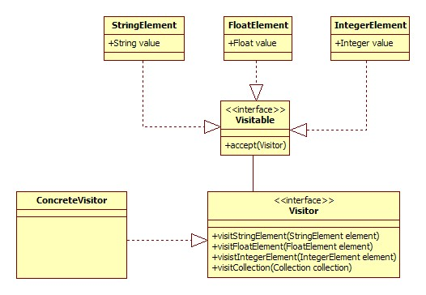
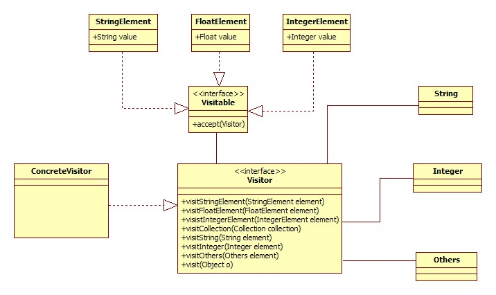

## JAVA设计模式之Visitor模式
[原文地址：JAVA设计模式之Visitor模式](http://blog.csdn.net/chenjie19891104/article/details/6393770)


一个集合（Collection）中，可以包含一个Car，也可以包含一个Cat，对于不同类型的元素，他们的行为也不尽相同，比如，Car可能有start()行为，而Cat可能有eat()的行为。可是对于Collection来说，不管你是Car，还是Cat，取出来的都是Object，那么我们如何知道取出来的是什么呢？
我们可能会如下操作：

```
Iterator itor = collection.iterator();
while(itor.hasNext()){
     Object o = itor.next();
     if(o instanceof Car){
          ((Car)o).start();
     }else if(o instanceof Cat){
          ((Cat)o).eat();
     }
}
``` 

这是你应该可以看出这种方式可能会出现的问题，假如现在Collection中放入了成千上万个不同类型的对象，也就意味着你需要成千上万个if else。这时，我们是否需要考量一下，我们的设计。。。
 
Yes！Visitor设计模式，就可以很好地解决这个问题。
 
Visitor设计模式，可以将一个集合中的元素和对各个元素的操作（行为）进行分离。首先我们看看Visitor设计模式中需要哪些组件来完成这个分离操作，如下图所示：




可见，Visitor模式中，集合中所有的元素必须实现Visitable接口，Visitable接口中声明了唯一的方法，这个方法注入Visitor对象，而Visitor接口是整个Visitor模式的核心组件，因为他包含了所有实现了Visitable接口的元素的行为，这样，当每个元素在accept()方法中就可以使用Visitor接口中自己需要的方法了。
但是，我们也看到，Visitor模式中，集合中的每种元素必需要实现Visitable接口来注入Visitor对象，这样Visitable相当于限定了集合中的各种对象，必须要实现Visitable接口。对于像String，Float等原有类型，则我们需要对其进行重新封装，实现Visitable接口，这样，无疑增加了代码容量。
还有一点，Visitor模式将所有的行为都放在Visitor中，这样破坏了类的封装性，不太符合开闭原则。（Visitor模式缺点）。所以，使用Visitor模式的时候，应当慎重权衡。
 
当然，可以采用Java反射技术来让Visitor模式变得更加灵活，使用反射技术后，集合中的元素将不再拘泥于实现了Visitable接口的类型，而可以是任意类型。使用了java反射技术后的组件模型如下图，




使用了反射技术后，在Visitor中我们多了一个visit(Object o)方法，该方法就是使用反射的技术来动态决定当前被访问的对象。
但是该方法则要求Visitor中所有对元素操作的方法按照规定来命名，该方法实现如下：

```

public void visit(Object o) {  
    String className = o.getClass().getName(); //获取类名称，这里是包含包名的全称  
    String methodName = "visit"+className.substring(className.lastIndexOf(".")+1);//组合获取方法名称  
    try {  
        //根据方法名从该类中获取相应的方法  
        Method m = this.getClass().getMethod(methodName, new Class[]{o.getClass()});  
        m.invoke(this, new Object[]{o});  
    } catch (NoSuchMethodException e) {  
        defaultVisit(o);  
    } catch (InvocationTargetException e) {  
        e.printStackTrace();  
    } catch (IllegalAccessException e) {  
        e.printStackTrace();  
    }  
}  


```


## 访问者模式
[原文地址:http://www.runoob.com/design-pattern/visitor-pattern.html](http://www.runoob.com/design-pattern/visitor-pattern.html)

在访问者模式（Visitor Pattern）中，我们使用了一个访问者类，它改变了元素类的执行算法。通过这种方式，元素的执行算法可以随着访问者改变而改变。这种类型的设计模式属于行为型模式。根据模式，元素对象已接受访问者对象，这样访问者对象就可以处理元素对象上的操作。

### 介绍

**意图：**主要将数据结构与数据操作分离。

**主要解决：**稳定的数据结构和易变的操作耦合问题。

**何时使用：**需要对一个对象结构中的对象进行很多不同的并且不相关的操作，而需要避免让这些操作"污染"这些对象的类，使用访问者模式将这些封装到类中。

**如何解决：**在被访问的类里面加一个对外提供接待访问者的接口。

**关键代码：**在数据基础类里面有一个方法接受访问者，将自身引用传入访问者。

**应用实例：**您在朋友家做客，您是访问者，朋友接受您的访问，您通过朋友的描述，然后对朋友的描述做出一个判断，这就是访问者模式。

**优点：**
1、符合单一职责原则。
2、优秀的扩展性。
3、灵活性。

**缺点：**
1、具体元素对访问者公布细节，违反了迪米特原则。
2、具体元素变更比较困难。
3、违反了依赖倒置原则，依赖了具体类，没有依赖抽象。

**使用场景：**
1、对象结构中对象对应的类很少改变，但经常需要在此对象结构上定义新的操作。
2、需要对一个对象结构中的对象进行很多不同的并且不相关的操作，而需要避免让这些操作"污染"这些对象的类，也不希望在增加新操作时修改这些类。

**注意事项：**访问者可以对功能进行统一，可以做报表、UI、拦截器与过滤器。

### 实现

我们将创建一个定义接受操作的 _ComputerPart_ 接口。_Keyboard_、_Mouse_、_Monitor_ 和 _Computer_ 是实现了 _ComputerPart_ 接口的实体类。我们将定义另一个接口 _ComputerPartVisitor_，它定义了访问者类的操作。_Computer_ 使用实体访问者来执行相应的动作。

_VisitorPatternDemo_，我们的演示类使用 _Computer_、_ComputerPartVisitor_ 类来演示访问者模式的用法。

#### 步骤 1

定义一个表示元素的接口。

```

public interface ComputerPart {   
	public void accept(ComputerPartVisitor computerPartVisitor);
}

```

#### 步骤 2

创建扩展了上述类的实体类。

```

public class Keyboard  implements ComputerPart { 
   @Override   
   public void accept(ComputerPartVisitor computerPartVisitor) {      
   		computerPartVisitor.visit(this);
   }
}
```

```

public class Monitor  implements ComputerPart { 
   @Override   
   public void accept(ComputerPartVisitor computerPartVisitor) {      
   		computerPartVisitor.visit(this); 
	}
}

```
```

public class Mouse  implements ComputerPart { 
   @Override   
   public void accept(ComputerPartVisitor computerPartVisitor{      
   		computerPartVisitor.visit(this);
	}
}
```

```

public class Computer implements ComputerPart {   
   ComputerPart[] parts;

   public Computer(){      
   parts = new ComputerPart[] {
   new Mouse(), new Keyboard(), new Monitor()};      
   } 


   @Override   public void accept(ComputerPartVisitor computerPartVisitor) {      
   		for (int i = 0; i < parts.length; i++) {        
    		parts[i].accept(computerPartVisitor);
    	}      
      computerPartVisitor.visit(this);
	}
}
```

#### 步骤 3

定义一个表示访问者的接口。


```
public interface ComputerPartVisitor {   
	public void visit(Computer computer);
   public void visit(Mouse mouse);
   public void visit(Keyboard keyboard);
   public void visit(Monitor monitor);
}
```
#### 步骤 4

创建实现了上述类的实体访问者。

```

public class ComputerPartDisplayVisitor implements ComputerPartVisitor { 
   @Override   public void visit(Computer computer) {     
    	System.out.println("Displaying Computer.");
   } 
   @Override   public void visit(Mouse mouse) {      
		System.out.println("Displaying Mouse.");
   } 
   @Override   public void visit(Keyboard keyboard) {      
   		System.out.println("Displaying Keyboard.");
   } 
   @Override   public void visit(Monitor monitor) {      
   		System.out.println("Displaying Monitor.");
   }
}
   
```

#### 步骤 5

使用 _ComputerPartDisplayVisitor_ 来显示 _Computer_ 的组成部分。

```
public class VisitorPatternDemo {   
	public static void main(String[] args) { 
      ComputerPart computer = new Computer();
      computer.accept(
      	new ComputerPartDisplayVisitor());
   }
}
```
#### 步骤 6

执行程序，输出结果：

```
Displaying Mouse.
Displaying Keyboard.
Displaying Monitor.
Displaying Computer.
```


