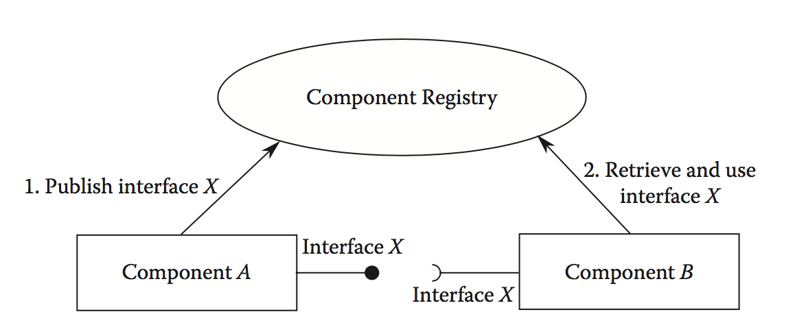

# Component- Oriented Development and Assembly Paradigm, Principles, and Practice using Java

The  key difference between both of these examples is that while modular kitchen parts can be assembled to arrive at the  nal product, o -the-shelf software products need to be integrated to arrive at the  nal product.

## Component Characteristics
### 1.4.1 Part of a Whole
### 1.4.2 Component Ecosystem
### 1.4.3 Component Framework
### 1.4.4 Component Model
### 1.4.5 Component Interfaces
### 1.4.6 Provided and Required Interfaces
Interfaces speci ed by a component are of two types. One type of interface is meant for other components to compose with this component and make use of the function- ality provided by this component.  is type of interface is called a provided interface. Another type of interface is meant for other components to compose with this compo- nent and provide some functionality to this component.  is type of interface is called a required interface. 

### Component Compatibility
### 1.4.7 Implementation Independence

## Component Model

## Componentizing the Virtual Store
In general, to compo- nentize a monolithic application, the following rules should be followed:

1. Keep the entity classes that represent domain objects in a separate common library to be shared by all the other components. Entity classes are considered as data carrying objects, and they are not considered as components.  e busi- ness entity classes can be instantiated by any other components.  e instances of the business entity classes can be passed around by other components to pass data values across components.
2.  If two classes depend on each other mutually, they should be together in one component.
3. After classes are grouped into components, we need to expose the business functionality provided by the component.

## OSGi

The functionality of the OSGi framework is divided into multiple layers:

-  Module layer
- Life cycle layer
- Service layer
- Security layer
- Actual services

The module layer de nes a modularity framework on top of the standard Java platform.  e life cycle layer manages the life cycles of the OSGi modules (also known as bundles) deployed in the framework.  e service layer provides a service registry along with a publish-lookup model for exposing services of a module.  e security layer builds on top of standard Java security and provides security at the OSGi bundles level. Apart from these layers, the OSGi standard speci es a set of standard services to be provided by the OSGi runtime.