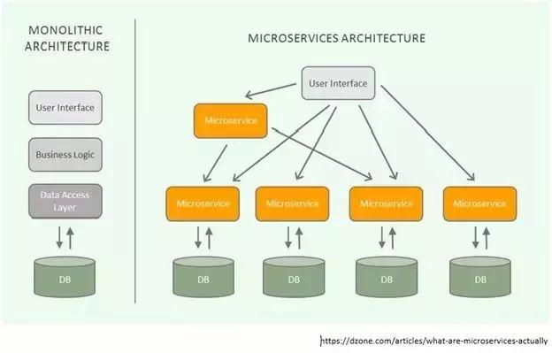
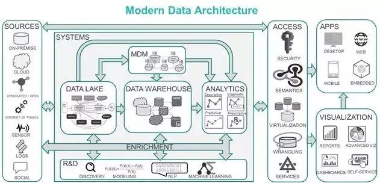
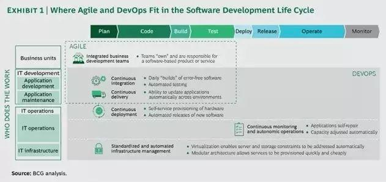

## 架构

深入理解企业的业务环境、商业转型方向以及技术现状，着手于：
* 设计企业级技术平台、数据平台的架构；
* 利用现代化软件工程方法论，构造各种面向未来、伸缩性强、定制化的解决方案；
* 促进现有系统的架构现代化，制定向云架构（数字化平台）的迁移策略；
* 制定企业架构的治理规范和管理策略。

## 人性化设计

数字化时代要有用户思维，企业级的业务和服务要以“产品”的方式向用户交付，企业应用系统要“消费化”（据此可以设想*微信*或钉钉对传统企业应用带来的冲击），既不断迎合创新，又合乎人性化的直觉应用，具体来说涉及到：

* 人类行为研究；
* 设计思维应用（用户画像、用户旅程、用户痛点和优先级评估、概念测试）；
* 概念评估、最小可用产品（MVP）定义；
* 原型开发，原型应用仿真；
* 概念描述和宣传。

## 敏捷交付

广义的敏捷（Agile）是企业运作模式的创新，就企业软件工程而言，是传统的瀑布式方式向螺旋迭代式转化的新一代软件交付模式。今天，在业务部门、IT开发部门（应用开发和应用维护）、IT运维（基础设施和运维）之间的协作、服务关系也在发生变化，企业技术管理者将*关注*于：

* 敏捷原则的应用；
* 设计、规划持续集成（CI）、持续交付（CD）的DevOps能力；
* 与企业高层、业务用户等形成伙伴关系，促进敏捷理念的深入；
* 关键项目的敏捷辅导

### 参考资料

[别被“去IOE”口号误导，数字化转型要点：架构、敏捷和设计](https://www.toutiao.com/i6712549867920556558)